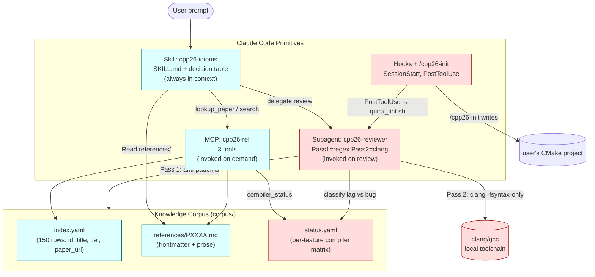

# cpp26-adapter — Binding Implementation Plan (v1.1)

**Owner:** parasxos · **Budget:** ~25 focused days, 2–3 months calendar · **Status:** binding, ready to execute.

---

## Context

The repo is a fresh skeleton (`.claude-plugin/`, `skills/cpp26-idioms/`, `mcp-server/`, `corpus/`, `agents/`, `hooks/`, `commands/`, `tools/` — all `.gitkeep`-only) plus a v0 plan in `PLAN.md`. Goal: ship an installable Claude Code plugin that biases generation toward C++26 final-form constructs from **ISO/IEC 14882:2026**, independent of compiler maturity.

**Why this exists.** A general-purpose model defaults to whatever C++ idiom is most represented in training data — that's overwhelmingly pre-C++26. Without active bias, users asking for "enum-to-string" get X-macros instead of `std::meta`, `assert` instead of `contract_assert`, `std::async` instead of senders. The plugin's job is to flip that default.

**Intended outcome.** Installed via `/plugin install`, the plugin (a) makes Claude suggest C++26 idioms automatically, (b) surfaces canonical paper/spec references on demand for ≥150 features, (c) classifies generated code as `pass | needs-changes | compiler-lag-only`, and (d) scores ≥85% correct idiom selection on a held eval suite vs the base model.

---

## Departures from PLAN.md (v0)

v0 is a solid framing but overbuilds in three places that will hurt a solo maintainer:

1. **MCP server is too heavy for v1.0.** v0 specifies FastMCP + sentence-transformers + pydantic + SQLite build step + vector index. That's a quarterly-refresh liability (Torch deps, model staleness, install footprint) for queries that are 90% paper-ID lookup. **Replaced with:** a 3-tool MCP backed by direct file reads against a markdown corpus, in-memory keyword + fuzzy scoring. No SQLite, no embeddings, no build step. If the corpus grows past ~2 MB, swap the search backend without changing the tool contract.
2. **YAML-as-storage + SQLite-at-install adds a build step.** Claude consumes markdown best (Read tool, progressive disclosure). **Replaced with:** markdown-native references (`references/PXXXX.md`) with a small YAML frontmatter for metadata. Skill points to them by path; MCP reads them too. One source of truth, no transform.
3. **Reviewer agent's "clang-tidy custom checks" track is YAGNI.** v0 already marks Stage 2 "later"; I drop it from v1.0 entirely. Regex + `clang -fsyntax-only` + status cross-reference is enough for the classification job.

Other adjustments: tier rebalance (20/50/80 instead of 30/80/40 — deep curation is the bottleneck), eval bar locked at **85%** to match the user-stated DoD (v0 used 90%), reviewer agent re-scoped to 2 days, phases re-ordered so the skill can be drafted in parallel with corpus extraction.

---

## Architecture



**Compiler-agnostic (cyan) vs compiler-aware (pink) is the invariant**: suggestion path never reads `status.yaml`; only the reviewer's Pass 2 and the SessionStart probe do.

### Information flow for "Add a serializer using reflection"

1. Skill is in context → constitution biases toward `std::meta`.
2. Claude calls `mcp__cpp26-ref__lookup_paper("P2996")` (or reads `references/P2996.md` directly).
3. Claude writes code using `^^`, splicers, `template for`.
4. PostToolUse hook runs `quick_lint.sh` (regex pass) — passes.
5. User/Claude invokes `@cpp26-reviewer` → Pass 1 (anti-patterns) clean; Pass 2 (`clang -std=c++2c -fsyntax-only`) errors → reviewer reads `status.yaml[P2996][clang-22] = partial` → classifies `compiler-lag-only`.
6. Final response: code + "correct per C++26 P2996; clang 22 partial — install `bloomberg/clang-p2996` to compile today."

---

## Phase plan

### Phase 0 — Setup (½ day)

- Write `.claude-plugin/plugin.json` (name, version, description, author).
- Write `LICENSE-CODE` (MIT) and `LICENSE-CORPUS` (CC-BY-SA 4.0).
- Decide and pin Python version for MCP (3.11+); add `mcp-server/pyproject.toml` with **only** `mcp`, `pyyaml`, `pydantic`.
- First commit; tag `v0.0.1`.

**Acceptance:** repo has manifest, licenses, MCP scaffold; `python -c "import mcp"` works in venv.

---

### Phase 1 — Knowledge corpus (6–8 days, the long pole)

#### 1a. Master index (1 day)

- Write `corpus/scripts/fetch_index.py`:
  - GitHub API → `cplusplus/papers` issues; filter `milestone="C++26"`, label contains `adopted`.
  - Extract `(paper_id, title, adopted_revision, adoption_meeting)`.
- Cross-check against `cppreference.com/w/cpp/26` (manual diff, log discrepancies).
- Manually assign tier per row.
- Output: `corpus/index.yaml` (one row per paper).

```yaml
# corpus/index.yaml
- id: P2996
  title: "Reflection for C++26"
  revision: R13
  meeting: "Sofia 2025-06"
  tier: deep      # deep | shallow | stub
  category: core
  ref: references/P2996.md
```

**Acceptance:** ≥150 rows tiered; 20 random rows match cppreference C++26 page.

#### 1b. Paper fetcher (½ day)

- `corpus/scripts/fetch_papers.py` resolves each `wg21.link/PXXXX` → cache HTML/PDF under `corpus/raw/` (gitignored). Track failures in `corpus/raw/fetch_log.json`. Retry failed manually.

**Acceptance:** ≥95% fetched.

#### 1c. Content extraction (4–6 days, the slog)

Authoring format is markdown with YAML frontmatter — no transform step:

```markdown
---
id: P2996
title: "Reflection for C++26"
revision: R13
tier: deep
category: core
keywords: [reflect, std::meta, splice, "^^", template for]
canonical_url: https://wg21.link/P2996R13
related: [P3068, P3096, P3394, P3491, P1306]
---

# P2996 — Reflection for C++26

## Problem
…

## Key syntax
- `^^E` — reflection operator
- `[: e :]` — splicer
- `std::meta::*` — introspection API

## Canonical example: enum to string
```cpp
template <typename E> requires std::is_enum_v<E>
constexpr std::string_view enum_name(E v) { … }
```

## Pre-C++26 equivalent
X-macros, Boost.Describe, magic_enum, external codegen.

## Gotchas
…
```

- **Deep tier (~20 papers, hand-curated):** problem, motivation, ≥1 canonical example (syntax-checked under best-available compiler), pre-C++26 equivalent, gotchas, related papers. Budget 2.5 hr/paper × 20 = 50 hr.
- **Shallow tier (~50 papers, LLM-assisted then spot-checked):** title, 1-paragraph summary, one canonical example, pre/post if obvious. Spot-check 15% manually. Budget 25 min/paper × 50 = ~21 hr.
- **Stub tier (~80 papers):** title + 1-sentence summary auto-extracted; no manual review. Budget 5 min/paper × 80 = ~7 hr.

**Major-tier seed list (already in PLAN.md §2.4):** P2996, P2900, P2300, P1306, P2662, P2573, P2893, P1967, P2795, P1673, P1121, P2545, P3471, P3068, P1938, P2169, P0843 — verify and extend during 1a.

**Acceptance:** every `index.yaml` row has a corresponding `references/PXXXX.md`; deep-tier examples pass `clang -std=c++2c -fsyntax-only` where compiler supports the feature (skip-when-unsupported is acceptable).

#### 1d. Compiler status table (½ day)

- Write `corpus/status.yaml` covering clang-22, clang-p2996, gcc-16, msvc-19.40 for **deep tier only** (shallow/stub default to "unknown"). Source: clang/gcc/MSVC cxx-status pages + Bloomberg `clang-p2996` README.
- Add `corpus/scripts/refresh_status.py` (manual-run, prints diffs vs current file).

**Acceptance:** all deep-tier features have rows for the four compilers.

#### 1e. Validation pass (½ day)

- CI job `tools/validate_corpus.py`:
  - Schema-check frontmatter (required keys present, tier ∈ {deep,shallow,stub}).
  - Extract fenced `cpp` blocks from deep-tier files; run each through `clang -std=c++2c -fsyntax-only`. Pass/skip/fail per snippet.
  - Lint: every `index.yaml` id has a `references/` file; no orphan files.
- Read 10 random shallow files end-to-end; fix issues.

**Acceptance:** validator clean; zero parse-failures on examples in deep-tier where compiler claims full support.

---

### Phase 2 — Skill: `cpp26-idioms` (1.5 days, runs partly parallel to Phase 1c)

`skills/cpp26-idioms/SKILL.md` ≤ 300 lines.

Structure:
- **Frontmatter** (`name`, `description` — must be model-discoverable).
- **Constitution** (≤10 lines): "generate against the standard, not the compiler" + how to handle compiler-lag.
- **Decision table** (~20 rows): C++26 idiom → pre-C++26 equivalent → paper ID → "see `references/PXXXX.md`". Built from the deep-tier list — can be drafted from PLAN.md §3 today.
- **Anti-pattern flag list** (~10 patterns): `assert(`, `BOOST_DESCRIBE_`, `std::async(`, hand-written enum→string switch, etc.
- **When to ignore** (legacy project signals, embedded targets, test code consistency).
- **MCP usage hints** ("for canonical syntax, call `mcp__cpp26-ref__lookup_paper`").

`skills/cpp26-idioms/references/` is a symlink or copy of `corpus/references/` — skills can ship their own references for progressive disclosure. Decide via testing whether to symlink (dev) and copy (release) or just point the skill at `../../corpus/references/` via relative path. **Pin choice:** at package time, the build script copies; in dev, symlink.

**Acceptance:** SKILL.md renders cleanly; decision table covers all deep-tier idioms; running Claude with the skill loaded and asking "write enum-to-string" produces reflection-based code on ≥3/3 manual trials.

---

### Phase 3 — MCP server: `cpp26-ref` (2 days)

Minimal stdio MCP server in `mcp-server/src/cpp26_ref/server.py`. **No SQLite, no sentence-transformers.**

Tools (3, not 6):

```python
@mcp.tool
def lookup_paper(paper_id: str) -> str:
    """Return the full markdown content of references/<paper_id>.md."""

@mcp.tool
def search(query: str, top_k: int = 5) -> list[dict]:
    """Keyword + fuzzy match across index.yaml (title, keywords, category).
    Returns [{id, title, tier, score, path}, ...]. Backed by rapidfuzz."""

@mcp.tool
def compiler_status(paper_id: str, compiler: str | None = None) -> dict:
    """Read corpus/status.yaml. INFORMATIONAL ONLY — skill must not gate
    on this."""
```

Implementation:
- Load `corpus/index.yaml` and `corpus/status.yaml` into memory at startup (~50 KB total — trivial).
- `lookup_paper`: `pathlib` read of `references/<id>.md`; raise if missing.
- `search`: `rapidfuzz.process.extract` over (`title` + `keywords` + `category`) strings; weight `title` ×2.
- `compiler_status`: dict lookup; default `unknown` if absent.

Tests in `mcp-server/tests/`:
- One unit test per tool against a 5-feature fixture corpus.
- One integration test: spin server via stdio, invoke each tool, assert response shape.

`.mcp.json` at repo root:
```json
{
  "mcpServers": {
    "cpp26-ref": {
      "command": "python",
      "args": ["-m", "cpp26_ref.server"],
      "cwd": "${CLAUDE_PLUGIN_ROOT}/mcp-server/src"
    }
  }
}
```

**Acceptance:** all 3 tools work end-to-end; cold start < 500 ms; lookup < 50 ms; tests green.

**Dependency:** Phase 1a (`index.yaml` schema) and 1c (at least 5 references for tests). Can start when Phase 1a lands.

---

### Phase 4 — Reviewer subagent: `cpp26-reviewer` (2 days)

`agents/cpp26-reviewer.md`. Markdown subagent.

Frontmatter:
```yaml
name: cpp26-reviewer
description: Reviews a C++ file or diff for C++26 standard compliance.
  Two-pass: standard-compliance regex check (always) and clang compile
  check (informational, classifies bug vs compiler-lag).
tools: [Read, Bash, Grep, mcp__cpp26-ref__lookup_paper, mcp__cpp26-ref__compiler_status]
model: sonnet
```

Body: explicit prompt covering both passes, the classification rules, and the YAML output schema.

**Pass 1 — anti-pattern regex (in agent body + helper script `tools/cpp26_lint/quick_lint.sh`):**

```yaml
# tools/cpp26_lint/patterns.yaml
- pattern: '\bassert\s*\('
  suggest: "use contract_assert"
  paper: P2900
- pattern: '\bBOOST_DESCRIBE_'
  suggest: "use std::meta reflection"
  paper: P2996
- pattern: '\bstd::async\s*\('
  suggest: "use std::execution sender"
  paper: P2300
# ~15 more, one per deep-tier idiom
```

Script reads file, emits findings as `{line, pattern, suggest, paper}` JSON. Agent invokes the script via Bash.

**Pass 2 — compiler check:**

- Agent runs `clang -std=c++2c -fsyntax-only -Werror <file> 2>&1 | tee /tmp/cpp26-diag.txt`.
- For each diagnostic, agent reasons: extract referenced symbol/feature → call `compiler_status(paper_id, compiler)` → if `support: none|partial` → classify `compiler-lag`; else `bug`.
- Conservative default: unknown → `bug`.

**Output schema** (agent returns this verbatim):

```yaml
status: pass | needs-changes | compiler-lag-only
standard_compliance:
  pass: true
  antipatterns:
    - { line: 42, pattern: "assert(", suggest: "contract_assert", paper: P2900 }
compile_check:
  pass: false
  bugs: []
  compiler_lag:
    - { line: 17, feature: "std::meta::reflect", paper: P2996,
        compiler: "clang-22", note: "expected in clang-25 or use bloomberg/clang-p2996" }
```

**Tests:** `agents/tests/fixtures/` — 10 snippets (5 clean C++26, 5 with anti-patterns or compiler-lag triggers), each with expected classification. CI script invokes the agent (via `claude -p ...` or a unit harness against the regex script alone) and asserts.

**Acceptance:** ≥90% classification accuracy on fixtures; **zero false-negatives on bugs** (over-classifying as bug is fine; under-classifying is not).

---

### Phase 5 — Hooks + slash command (1 day)

`hooks/hooks.json`:
```json
{
  "hooks": {
    "SessionStart": [
      { "command": "${CLAUDE_PLUGIN_ROOT}/tools/check_toolchain.sh",
        "description": "Detect C++ toolchain; warn if clang<22 or gcc<16" }
    ],
    "PostToolUse": [
      { "matcher": "Edit|Write",
        "filePattern": "*.{cpp,h,hpp,cxx,cc}",
        "command": "${CLAUDE_PLUGIN_ROOT}/tools/cpp26_lint/quick_lint.sh",
        "description": "Pass-1 regex anti-pattern check" }
    ]
  }
}
```

`commands/cpp26-init.md` (slash command):
- Detect existing `CMakeLists.txt`; if absent, scaffold one with `set(CMAKE_CXX_STANDARD 26)` + `add_compile_options(-std=c++2c)` + `CMAKE_EXPORT_COMPILE_COMMANDS ON`.
- Write `.clangd` pointing at the user-preferred toolchain.
- Write `.cpp26-adapter.yaml` (project overrides — e.g., "skip-skill: true" for legacy modules).
- Append to README a "C++26 toolchain expectations" section.

`tools/check_toolchain.sh`: prints clang/gcc/msvc versions; emits a stderr line if all below thresholds (Claude surfaces this on SessionStart).

`tools/cpp26_lint/quick_lint.sh`: reads target file path from `$CLAUDE_TOOL_INPUT` (or hook payload); runs the regex pass; emits findings to stdout (Claude surfaces them).

**Acceptance:** `/cpp26-init` on an empty dir produces a buildable CMake project; PostToolUse hook fires and prints findings on an edit that introduces `assert(`.

---

### Phase 6 — Packaging & local install test (½ day)

- Finalize `.claude-plugin/plugin.json`:
```json
{
  "name": "cpp26-adapter",
  "version": "1.0.0",
  "description": "Turn Claude into a C++26 specialist via standard-first idiom bias, reference MCP, and verification.",
  "author": { "name": "Paris Moschovakos" },
  "components": {
    "skills": ["skills/cpp26-idioms"],
    "agents": ["agents/cpp26-reviewer.md"],
    "commands": ["commands/cpp26-init.md"],
    "hooks": "hooks/hooks.json",
    "mcpServers": ".mcp.json"
  }
}
```
- Write `tools/package.sh`: copies `corpus/references/` into `skills/cpp26-idioms/references/`, tars the repo, prints install size.
- Test `/plugin install` from a local marketplace on a clean Claude Code (a second machine or a fresh user account).

**Acceptance:** clean install on a second environment; full feature path (skill → MCP lookup → review) works end-to-end; install tarball < 5 MB.

---

### Phase 7 — Eval suite & iteration (3–4 days)

This is the gate. **DoD bar: 85% standard-compliance on the held suite.**

#### 7a. Build eval suite (1 day)

`eval/tasks.yaml`: 40 tasks, ≥1 per deep-tier idiom, ≥1 per category. Each:
```yaml
- id: enum-to-string
  prompt: "Write enum-to-string for enum class Color { Red, Green, Blue }; that returns std::string_view."
  rule_tested: P2996
  expected_idiom: "uses std::meta or template for; does not use X-macros, switch, or magic_enum"
  must_not_contain: ["#define", "magic_enum", "switch.*case.*Red"]
  must_contain: ["std::meta", "^^"]
```

#### 7b. Eval harness (½ day)

`eval/run.py`:
- For each task, invoke Claude twice (plugin OFF, plugin ON) via `claude -p`.
- Score each output on three axes:
  1. **Standard compliance (binary):** uses C++26 idiom or fallback? (regex on must_contain/must_not_contain)
  2. **Syntactic correctness (binary):** parses under `clang -std=c++2c -fsyntax-only`?
  3. **Idiomatic quality (1–5):** LLM-judge with rubric (`claude -p` against a judge prompt).
- Write `eval/results-vX.Y.md`.

#### 7c. Iterate (2–3 days)

- Identify systematic failures (e.g., model keeps reaching for `assert`).
- Strengthen SKILL.md decision table for failing cases.
- Add more anti-pattern regexes if a class of failure can be deterministically caught.
- If model still ignores skill → tighten `description` frontmatter (skill activation depends on it).
- Last resort: a PostToolUse hook that auto-prepends a steering note when an anti-pattern is detected mid-generation.
- Re-run eval until ≥85% on axis 1 (the DoD axis).

**Acceptance:** `eval/results-v1.0.md` shows ≥85% standard-compliance, ≥80% syntactic correctness (compiler-lag features can fail Pass 2 and still count as pass on axis 1), median idiomatic-quality ≥4/5.

---

### Phase 8 — Distribution (1 day)

- Push to `parasxos/claude-plugins` as a personal marketplace (`marketplace.json` with one entry).
- Verify `/plugin install cpp26-adapter@parasxos/claude-plugins` works from someone else's machine.
- Write the announcement: short README delta + a `docs/architecture.md` with the diagram and the "standard-first" rationale (this is the differentiator vs other C++ plugins).
- Optional, post-v1.0: submit to `wshobson/agents` or Anthropic's official marketplace.

**Acceptance:** plugin discoverable via personal marketplace; ≥1 external installer before declaring v1.0 done.

---

### Phase 9 — Maintenance scaffolding (½ day at v1.0, ~1 day/quarter ongoing)

- `tools/refresh.sh`: runs `fetch_index.py` (diff against `index.yaml`, emit new-paper rows), `refresh_status.py` (diff compiler-status pages), `eval/run.py`. Output: a `MAINTENANCE.md` checklist with hand-actionable items.
- GitHub Action (or local cron): monthly run of `tools/refresh.sh`, opens an issue if diffs are non-empty.
- Document quarterly process in `MAINTENANCE.md`: (1) merge new C++26 defect-report papers, (2) refresh compiler status, (3) re-run eval, (4) bump corpus version in `index.yaml` header.

**Acceptance:** `MAINTENANCE.md` exists; running `tools/refresh.sh` on day 0 produces an empty checklist (clean baseline).

---

## Effort summary

| Phase | Effort | Calendar position |
|---|---:|---|
| 0. Setup | ½ d | day 1 |
| 1. Corpus | 6–8 d | weeks 1–2 (long pole) |
| 2. Skill | 1.5 d | week 2 (parallel with 1c) |
| 3. MCP | 2 d | week 2–3 (after 1a) |
| 4. Reviewer | 2 d | week 3 |
| 5. Hooks + /init | 1 d | week 3 |
| 6. Packaging | ½ d | week 4 |
| 7. Eval + iterate | 3–4 d | week 4 (gate) |
| 8. Distribution | 1 d | week 4 |
| 9. Maintenance scaffold | ½ d | week 4 |
| **Total** | **~18–22 focused days** | 2–3 mo calendar |

Buffer (3–7 days) absorbs the corpus slog overrunning and the eval-iteration loop.

---

## Critical files to be created/modified

| Path | Phase | Purpose |
|---|---|---|
| `.claude-plugin/plugin.json` | 0, 6 | Manifest |
| `.mcp.json` | 3 | MCP server registration |
| `corpus/index.yaml` | 1a | Master 150-row index |
| `corpus/references/PXXXX.md` | 1c | Per-feature reference (markdown + frontmatter) |
| `corpus/status.yaml` | 1d | Compiler-status matrix (deep-tier only) |
| `corpus/scripts/fetch_index.py` | 1a | GitHub API → index.yaml |
| `corpus/scripts/fetch_papers.py` | 1b | wg21.link → raw cache |
| `corpus/scripts/refresh_status.py` | 1d, 9 | Diff compiler-status pages |
| `tools/validate_corpus.py` | 1e | CI schema + example syntax check |
| `skills/cpp26-idioms/SKILL.md` | 2 | The constitution + decision table |
| `skills/cpp26-idioms/references/` | 2, 6 | Symlink (dev) / copy (release) of corpus refs |
| `mcp-server/src/cpp26_ref/server.py` | 3 | 3-tool MCP, in-memory load |
| `mcp-server/pyproject.toml` | 0, 3 | Deps: `mcp`, `pyyaml`, `pydantic`, `rapidfuzz` |
| `mcp-server/tests/` | 3 | Per-tool unit + integration tests |
| `agents/cpp26-reviewer.md` | 4 | Two-pass reviewer subagent |
| `agents/tests/fixtures/` | 4 | 10 classified snippets |
| `tools/cpp26_lint/patterns.yaml` | 4 | Regex anti-pattern table |
| `tools/cpp26_lint/quick_lint.sh` | 4, 5 | Regex pass invokable from hook/agent |
| `tools/check_toolchain.sh` | 5 | SessionStart probe |
| `hooks/hooks.json` | 5 | SessionStart + PostToolUse wiring |
| `commands/cpp26-init.md` | 5 | `/cpp26-init` slash command |
| `tools/package.sh` | 6 | Release tarball build |
| `eval/tasks.yaml` | 7a | 40-task suite |
| `eval/run.py` | 7b | Harness, 3-axis scoring |
| `eval/results-v1.0.md` | 7c | Eval gate evidence |
| `tools/refresh.sh` | 9 | Quarterly maintenance entry point |
| `MAINTENANCE.md` | 9 | Operator checklist |

---

## Verification

End-to-end, before declaring v1.0:

1. **Fresh install on a second environment:**
   `/plugin install cpp26-adapter@parasxos/claude-plugins` → confirm skill, MCP, agent, hooks, command all register (`/plugin` listing, `/agents` listing, `/mcp` listing).
2. **Skill activation:** open a fresh session in a C++ project; ask "write enum-to-string for `enum class E { A, B }`" without mentioning C++26. Confirm output uses `std::meta` / `template for` (not X-macros).
3. **MCP lookup:** ask "what's the canonical reflection example?" → Claude calls `mcp__cpp26-ref__lookup_paper("P2996")` (visible in tool-use trace) and returns content from `references/P2996.md`.
4. **Reviewer happy path:** invoke `@cpp26-reviewer` on a clean C++26 file → `status: pass`.
5. **Reviewer anti-pattern:** invoke on a file with `assert(x > 0);` → `status: needs-changes`, antipattern entry references P2900.
6. **Reviewer compiler-lag:** invoke on a reflection snippet under clang 22 → `status: compiler-lag-only`, lag entry references P2996.
7. **Slash command:** `/cpp26-init` in empty dir → produces buildable `CMakeLists.txt` (verify with `cmake -B build && cmake --build build` against a hello-world `main.cpp`).
8. **Hooks fire:** edit a `.cpp` file to introduce `BOOST_DESCRIBE_STRUCT` → PostToolUse surfaces a P2996 anti-pattern finding.
9. **SessionStart probe:** start session on a box with clang 21 → warning surfaces; with clang 22+ → silent.
10. **Eval gate:** `python eval/run.py` → `results-v1.0.md` shows ≥85% on axis 1.
11. **Validator green:** `python tools/validate_corpus.py` → exit 0.
12. **Tests green:** `pytest mcp-server/tests` and reviewer fixture harness → all pass.

---

## Risk register

| # | Risk | Likelihood | Impact | Mitigation |
|---|---|:-:|:-:|---|
| 1 | Deep-tier corpus extraction blows the schedule | H | M | Tier rebalance (20 deep, not 30); LLM-assist shallow tier; defer 5 deep papers to v1.1 if needed |
| 2 | Skill ignored despite prose | M | H | Eval gate forces iteration; hook-enforced steering as last resort; frontmatter `description` carefully tuned for activation |
| 3 | Compiler-status data goes stale fast | Certain | L | Quarterly `refresh.sh`; staleness banner in MCP responses; reviewer surfaces `last_refreshed` |
| 4 | Bloomberg `clang-p2996` diverges from P2996 final | M | M | Track revision in status.yaml; refresh on each new R |
| 5 | Reviewer mis-classifies real bug as compiler-lag | M | H | Conservative default `bug` when status is unknown; fixture has explicit false-positive cases |
| 6 | Skill over-applies to legacy C++23 codebases | M | L | "When to ignore" section; `/cpp26-init` writes `.cpp26-adapter.yaml` override; detect existing `CXX_STANDARD < 26` |
| 7 | Maintainer burnout (solo) | M | H | Maintenance scaffold (`refresh.sh`) front-loaded; quarterly cadence, not monthly |
| 8 | C++26 amended post-publication (defect reports) | L | M | Refresh script diffs `cplusplus/papers` issue list |
| 9 | MCP search quality poor without embeddings | M | L | Start with rapidfuzz + keyword weights; upgrade to embeddings only if eval shows lookup failures dominating |
| 10 | Eval over-fits to test tasks | M | M | 40 tasks across all deep-tier rules; rotate 25% between minor releases |
| 11 | Plugin install path differs across Claude Code surfaces (CLI vs web vs IDE) | L | M | Test on at least CLI + one IDE before v1.0 announce |
| 12 | Skill `references/` symlink breaks on package step | L | L | `tools/package.sh` copies, doesn't symlink; CI checks for dangling links pre-release |

---

*End of binding plan.*
