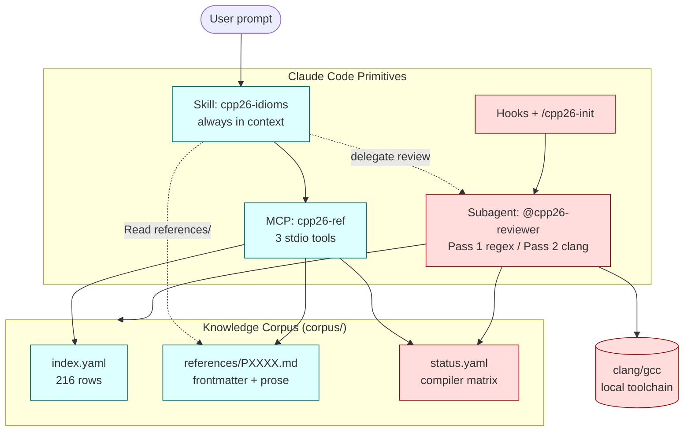

# cpp26-adapter

**Turn your LLM coding assistant into a C++26 specialist.**
A Claude Code plugin that biases generation toward ISO/IEC 14882:2026 final-form idioms — reflection, contracts, senders, `inplace_vector`, `#embed` — even when your local clang hasn't caught up.

[](https://github.com/parasxos/cpp26-adapter/actions/workflows/ci.yml)
[](https://github.com/parasxos/cpp26-adapter/releases/tag/v0.9.0)
[-brightgreen)](eval/results-v0.9.0.md)
[](eval/results-v0.9.0.md)
[](https://www.iso.org/standard/83626.html)
[](LICENSE-CODE)
[](LICENSE-CORPUS)

```
/plugin marketplace add parasxos/claude-plugins
/plugin install cpp26-adapter@parasxos/claude-plugins
```

---

## The hook — ask for "enum to string"

**Vanilla LLM** falls back to X-macros (or pulls in `magic_enum`):

```cpp
#define COLORS(X) X(Red) X(Green) X(Blue)
enum class Color { COLORS(GEN_ENUM) };
constexpr const char* to_string(Color c) {
    switch (c) { COLORS(GEN_CASE) }
    return "<unknown>";
}
```

**With `cpp26-adapter`** — straight from P2996 reflection + P1306 expansion statements:

```cpp
template <typename E> requires std::is_enum_v<E>
constexpr std::string_view enum_name(E v) {
    template for (constexpr auto e :
                  std::define_static_array(std::meta::enumerators_of(^^E))) {
        if (v == [: e :]) return std::meta::identifier_of(e);
    }
    return "<unknown>";
}
```

No macros. No third-party dep. No codegen. The standard already shipped the answer — the plugin's job is to make sure your assistant uses it.

---

## Six idiom shifts, side by side

| You ask for… | Vanilla LLM emits | `cpp26-adapter` emits |
|---|---|---|
| enum → string | X-macros / `magic_enum` / switch ladder | `std::meta::enumerators_of(^^E)` + `template for` |
| a precondition | `assert(x > 0);` | `pre(x > 0)` / `contract_assert(...)` |
| async pipeline | `std::async(...)` | `ex::just \| ex::then \| ex::sync_wait` |
| fixed-capacity vector | `boost::container::static_vector` | `std::inplace_vector<T, N>` |
| embed a binary asset | `objcopy` / `xxd` / `incbin` | `#embed "asset.bin"` |
| Nth element of a pack | `std::get<N>(std::forward_as_tuple(args...))` | `args...[N]` |

---

## The architectural invariant

> **Recommendations follow the standard, not the toolchain.**

If `clang < 22` / `gcc < 16` haven't implemented a feature yet, the plugin still suggests the C++26 form. Compiler errors are surfaced **informationally** — classified as `compiler-lag` (paper adopted, compiler incomplete) or `bug` (genuine error in your code) — **never auto-rewritten into a pre-C++26 workaround**.

This invariant draws a hard line through the implementation. The **suggestion path (skill + MCP) is compiler-agnostic**; compiler awareness lives only in the reviewer's Pass-2 syntax check and the SessionStart probe. The cyan/pink split in the diagram below is the same line, drawn in code form.

---

## What changes when this is installed

### A. Preconditions

> *"`int divide(int a, int b)` — express that `b != 0` is a programmer error."*

**Vanilla** — `assert(b != 0);` (disappears in release builds).
**With plugin** — P2900 contracts, enforced under the build's chosen contract-evaluation semantic:

```cpp
int divide(int a, int b) pre (b != 0) { return a / b; }
```

### B. Async pipeline

> *"Start with 7, multiply by 6, wait synchronously."*

**Vanilla** — `std::async(std::launch::async, []{ return 7*6; }).get();`
**With plugin** — P2300 `std::execution` senders:

```cpp
namespace ex = std::execution;
auto [r] = ex::sync_wait(ex::just(7) | ex::then([](int x){ return x*6; })).value();
```

### C. Embed a binary asset

> *"Include the bytes of `assets/icon.png` as a constexpr array."*

**Vanilla** — pre-build `xxd -i` or `objcopy --add-section`.
**With plugin** — P1967:

```cpp
constexpr unsigned char icon_png[] = {
    #embed "assets/icon.png"
};
```

---

## How it works

A standard-first suggestion path; a toolchain-honest verification path. The two never collapse into each other.

| Component | What it does |
|---|---|
| **Skill** `cpp26-idioms` | 136-line constitution + 20-row decision table + 12 anti-pattern regexes — always in context, biases generation before a single token is emitted. |
| **MCP** `cpp26-ref` | 3 stdio tools (`lookup_paper`, `search` with rapidfuzz partial-ratio, `compiler_status`); 17 tests pass; ~352 ms cold start; in-memory over 216 indexed papers. No SQLite, no embeddings, no build step. |
| **Subagent** `@cpp26-reviewer` | Two-pass: Pass 1 regex anti-pattern lint, Pass 2 `clang -std=c++2c -fsyntax-only` with each diagnostic routed through `mcp__cpp26-ref__compiler_status` and classified `bug` vs `compiler-lag`. |
| **Hooks** | `SessionStart` probes your C++ toolchain (informational warn if `clang < 22` / `gcc < 16`); `PostToolUse` Pass-1 lints every `Edit`/`Write` of a C++ file. |
| **Command** `/cpp26-init` | Scaffolds a C++26-ready `CMakeLists.txt` (`CXX_STANDARD 26`, `-std=c++2c`, `CMAKE_EXPORT_COMPILE_COMMANDS ON`), `.clangd`, and `.cpp26-adapter.yaml`. |



**Cyan = compiler-agnostic, pink = compiler-aware.** The suggestion layer never reads `status.yaml`. Only the reviewer's Pass 2 and the SessionStart probe do.

Long-form rationale in [`docs/architecture.md`](docs/architecture.md).

---

## Knowledge corpus

**216 papers indexed** from `cplusplus/papers` (union of `label:C++26 + plenary-approved` with `label:IS + plenary-approved` minus other-version IS papers — this catches plenary-adopted papers that were never re-labelled). Spot-checked against [cppreference.com/w/cpp/26](https://en.cppreference.com/w/cpp/26): **19/20 random rows match.**

Tiering: **16 hand-curated deep references** with frontmatter + Problem + Key syntax + Canonical example + Pre-C++26 equivalent + Gotchas + Related; **52 templated shallow refs**; **148 stubs** for full surface coverage and search recall.

The 16 deep papers — the C++26 surface the plugin biases hardest toward:

| Paper | Feature | Headline idiom |
|---|---|---|
| **P2996** | Reflection | `^^`, splicers, `std::meta` |
| **P2900** | Contracts | `pre`/`post`/`contract_assert` |
| **P2300** | `std::execution` | senders / receivers |
| **P1306** | Expansion statements | `template for` |
| **P2662** | Pack indexing | `args...[N]` |
| **P2573** | `= delete("reason")` | deletion with diagnostics |
| **P2893** | Variadic friends | `friend Ts...;` |
| **P1967** | `#embed` | binary-asset embedding |
| **P2795** | Erroneous behaviour | uninit-read sanitization |
| **P1673** | `std::linalg` | BLAS-style linear algebra |
| **P2530** | Hazard pointers | lock-free reclamation |
| **P2545** | RCU | read-copy-update |
| **P3471** | Library hardening | bounds-checked containers |
| **P3068** | `throw` in constexpr | constant-eval diagnostics |
| **P2169** | Placeholder `_` | unused-binding placeholder |
| **P0843** | `std::inplace_vector` | fixed-capacity container |

---

## Eval gate

A held suite of **39 tasks** (≥1 per deep-tier idiom, ≥1 per category) scored on three axes per task: standard-compliance (regex on fenced cpp blocks), syntactic correctness (`clang -std=c++2c -fsyntax-only`), and idiomatic quality (LLM-judge, 1–5 rubric).

| Suite | Plugin ON | Plugin OFF | Bar | Margin |
|---|---:|---:|---:|---:|
| 39-task held suite | **37/39 (95%)** | 14/39 (36%) | ≥85% | **+10 pp** |

Per-task breakdown: [`eval/results-v0.9.0.md`](eval/results-v0.9.0.md). Harness: [`eval/run.py`](eval/run.py).

**Methodology note.** The first audited run scored 23/39 (59%). The audit traced the gap to the eval regex matching prose mentions of pre-C++26 names rather than the fenced `cpp` answer block. A one-line harness change (anchor `must_not_contain` to the last fenced block) recovered the full delta — **no `SKILL.md` changes were required.** That distinction matters: the eval gate measures the plugin, not the harness.

---

## Install and verify

From the personal marketplace:

```
/plugin marketplace add parasxos/claude-plugins
/plugin install cpp26-adapter@parasxos/claude-plugins
```

Or from a local clone for development:

```bash
git clone https://github.com/parasxos/cpp26-adapter.git
cd cpp26-adapter
mcp-server/.venv/bin/pip install -e mcp-server   # one-time MCP setup
claude --plugin-dir .                            # load for this session
```

Three sanity checks that should all work with no further setup:

1. Ask Claude *"write enum-to-string for `enum class E { A, B }`"* — the response should use `std::meta` reflection, not X-macros or `magic_enum`.
2. Run `@cpp26-reviewer src/foo.cpp` — should return a YAML report with `status: pass | needs-changes | compiler-lag-only`.
3. Run `/cpp26-init` in an empty directory — the scaffolded `CMakeLists.txt` should build a `#include <print>` + `std::print("hi\n")` hello-world via `cmake -B build && cmake --build build`.

---

## FAQ

**My toolchain is clang 21 / gcc 15. Will the suggestions even compile?**
Often no — and that's by design. The reviewer's Pass 2 runs `clang -std=c++2c -fsyntax-only` and classifies each diagnostic as `compiler-lag` (paper adopted, compiler incomplete) or `bug` (genuine code error). You see both axes side by side. The suggestion is never silently downgraded to a pre-C++26 workaround. For reflection demos before clang 22 ships, use [`bloomberg/clang-p2996`](https://github.com/bloomberg/clang-p2996).

**Will it rewrite my legacy C++17/20/23 code?**
No. The plugin only fires on new generation and on files you explicitly hand to `@cpp26-reviewer`. Existing code is untouched. For a subdirectory you want fully exempt, drop a `.cpp26-adapter.yaml` containing `skip-skill: true` — the skill defers in that subtree.

**What about C++23 or C++29?**
Out of scope. The plugin is purpose-built for C++26 final form (ISO/IEC 14882:2026). C++23 idioms are not corrected; C++29 is not addressed.

**How is it kept current with paper revisions and compiler progress?**
Quarterly refresh via `tools/refresh.sh` — re-pulls the paper index, scrapes compiler-status pages, re-runs the eval. Process documented in [`MAINTENANCE.md`](MAINTENANCE.md). The v1.0 trigger is two successive eval-passing refreshes.

**How is the corpus sourced?**
`corpus/scripts/fetch_index.py` queries `cplusplus/papers` via the GitHub API and unions two filters to catch plenary-adopted-but-unlabelled papers. The 16 deep references are hand-authored against the canonical paper text; shallow and stub tiers are template-generated from the index. Everything in `corpus/` is CC-BY-SA-4.0 and derives from public WG21 material — see [`LICENSE-CORPUS`](LICENSE-CORPUS) for attribution.

---

## What this plugin is **not**

- It does **not** retrain or fine-tune any model.
- It does **not** patch your compiler. `compiler-lag` is a label, not a fix.
- It does **not** ship C++29 support. That's a non-goal.
- It does **not** rewrite existing source files unprompted. The reviewer is opt-in; the hook only surfaces findings on edits Claude itself authored.
- It does **not** ship a fork of clang. If you need a reflection-capable build today, install [`bloomberg/clang-p2996`](https://github.com/bloomberg/clang-p2996).

---

## Status

**v0.9.0 — feature-complete, eval gate cleared, pre-1.0.**

The implementation works end-to-end and clears the eval bar (95% vs ≥85% required). `v1.0` is gated on two successive quarterly refreshes that hold the bar, per [`MAINTENANCE.md`](MAINTENANCE.md). The MCP tool signatures and the subagent's output schema are considered stable for the `0.9.x` series.

---

## License

Dual-licensed by directory:

- **Code** (everything outside `corpus/`): MIT — [`LICENSE-CODE`](LICENSE-CODE).
- **Knowledge corpus** (`corpus/`): CC-BY-SA 4.0 — [`LICENSE-CORPUS`](LICENSE-CORPUS).

---

## See also

- [`docs/architecture.md`](docs/architecture.md) — the standard-first invariant in long form.
- [`PLAN.md`](PLAN.md) — the binding implementation plan with phase-level acceptance criteria.
- [`MAINTENANCE.md`](MAINTENANCE.md) — quarterly refresh process and the v1.0 trigger.
- [`eval/results-v0.9.0.md`](eval/results-v0.9.0.md) — per-task scoring from the gate run.
- Plugin repo: [github.com/parasxos/cpp26-adapter](https://github.com/parasxos/cpp26-adapter)
- Marketplace: [github.com/parasxos/claude-plugins](https://github.com/parasxos/claude-plugins)
