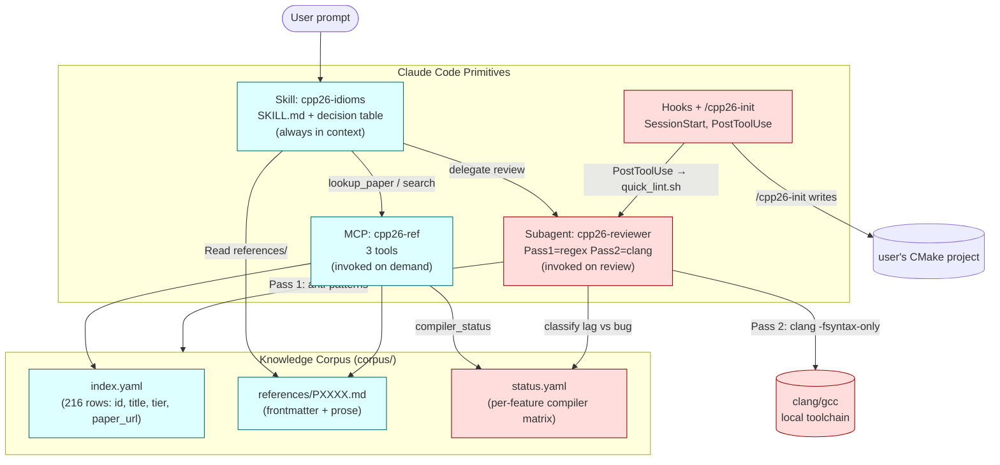

# cpp26-adapter — architecture

A general-purpose LLM defaults to whatever C++ idiom dominates its training
data — overwhelmingly **pre-C++26**. Without active bias, a request for
"enum to string" returns X-macros instead of `std::meta`; "an assertion"
returns `assert(...)` instead of `contract_assert(...)`; "an async
pipeline" returns `std::async` instead of an `std::execution` sender chain.

The cpp26-adapter plugin's job is to flip that default — and to do it
without lying about what the local compiler can or cannot accept.

## The architectural invariant

> **Recommendations follow the standard, not the toolchain.**

If `clang 22` / `gcc 16` haven't implemented a feature yet, the plugin
suggests the C++26 form anyway. Compiler errors are surfaced
*informationally* — classified `compiler-lag` (paper adopted, compiler
incomplete) or `bug` (genuine error in the code) — never auto-rewritten
into a pre-C++26 workaround.

This invariant draws a hard line through the implementation: the
**suggestion path is compiler-agnostic**; compiler awareness lives only
in the reviewer's Pass-2 syntax check and the SessionStart probe.

## Components



**Cyan = compiler-agnostic, pink = compiler-aware.** That separation
is the invariant: the suggestion layer (skill + MCP) never reads
`status.yaml`; only the reviewer's Pass 2 and the SessionStart probe do.

## What happens when a user asks for "enum to string"

1. The `cpp26-idioms` skill is in context — its decision table maps
   "enum to string" to **P2996 reflection + P1306 expansion statements**.
2. Claude calls `mcp__cpp26-ref__lookup_paper("P2996")` to retrieve the
   canonical syntax (`^^E`, `[: e :]`, `std::meta::enumerators_of`).
3. Claude writes:
   ```cpp
   template <typename E> requires std::is_enum_v<E>
   constexpr std::string_view enum_name(E v) {
       template for (constexpr auto e :
                     std::define_static_array(std::meta::enumerators_of(^^E))) {
           if (v == [: e :]) return std::meta::identifier_of(e);
       }
       return "<unknown>";
   }
   ```
4. The PostToolUse hook runs `quick_lint.py` — passes (no anti-patterns).
5. If the user invokes `@cpp26-reviewer`, the agent runs
   `clang -std=c++2c -fsyntax-only`. On clang 21 this errors with
   "unknown type name 'meta'" → the reviewer reads
   `status.yaml[P2996][clang-22] = partial`, classifies the diagnostic
   as `compiler-lag-only`, and the final report tells the user:
   *"Correct per C++26 P2996. clang 22 mainline is partial — install
   bloomberg/clang-p2996 for a reflection-capable build."*

The code in the buffer is C++26-correct. The classification is honest
about the local toolchain. Neither is sacrificed for the other.

## Differentiator vs other C++ plugins

Most C++ assistants either:
- **Lag-track the toolchain**: they only suggest features the local
  compiler supports today, freezing the model in C++20 ergonomics
  even though the standard has moved on; or
- **Ignore the toolchain entirely**: they suggest standard idioms with
  no recognition that the user's clang errors are about implementation
  status, not their code.

cpp26-adapter does neither. It picks a single, principled position —
*standard-first suggestions, toolchain-honest verification* — and lets
the user see both axes simultaneously. That's the differentiator the
plugin trades on, and it's the reason the suggestion path lives in
the cyan box of the diagram while the reviewer lives in the pink.

## Designed-around constraints (from the binding plan)

- **Solo-maintainer-friendly**: corpus is markdown + YAML (no SQLite,
  no embeddings, no build step). MCP loads ~50 KB at startup, in
  memory. Quarterly refresh is a single command (`tools/refresh.sh`).
- **Install footprint < 5 MB**: release tarball is ~200 KB. The 40 MB
  raw-paper cache is gitignored and rebuildable from `index.yaml`.
- **Eval gate ≥ 85% standard-compliance**: held suite of 39 tasks,
  scored by regex against fenced cpp blocks + LLM-judge for quality.
  v0.9.0 cleared 95% on first audited run.

See [`MAINTENANCE.md`](MAINTENANCE.md) for the quarterly refresh process.
